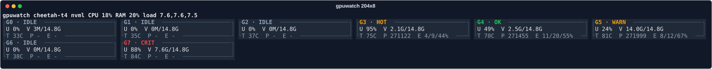

# gpuwatch

`gpuwatch` is a responsive terminal GPU monitor for NVIDIA training servers. It is meant to
replace aliases such as:

```bash
watch -n 0.1 nvidia-smi
```

The UI adapts to terminal size. Short terminals show square-ish GPU blocks, medium terminals
show compact process cards, and large terminals show GPU, process, and training-progress
tables. The default theme is `soft-dark`.



## Features

- NVIDIA GPU sampling through NVML with a fake backend for local UI development.
- Per-GPU utilization, VRAM, temperature, fan, power, PID, and process information.
- Host CPU, RAM, and load average summary.
- Responsive Rich/Textual UI with `soft-dark`, `terminal`, and `light` themes.
- ASCII fallback for terminals that do not render Unicode box characters well.
- Training progress detection from `TrainingRun` heartbeat files, recent `.log` files, and
  project roots inferred from active GPU process working directories.
- JSON output for scripting and dashboards.

## Repository Layout

```text
gpuwatch/
  gpuwatch/               Python package
    backends/             NVML, fake GPU, and host samplers
    render/               Rich/Textual rendering code
    training/             Training heartbeat and log status parsing
  tests/                  Unit tests for sampling, rendering, and training status
  tools/                  Developer utilities
  docs/screenshots/       Responsive SVG screenshots
  docs/REPOSITORY.md      Repository maintenance notes
  skills/gpuwatch/        Codex skill/manual for local GPU inspection workflows
  pyproject.toml          Build metadata and dependencies
```

## Requirements

- Python 3.9 or newer.
- `psutil`, `rich`, and `nvidia-ml-py`.
- NVIDIA driver and NVML runtime for real GPU sampling.
- `textual` for the full-screen TUI. It is included in the `tui` extra.

The fake backend works without NVIDIA hardware and is useful for testing the UI.
When `gpuwatch` or `gpuwatch once` runs in the default `auto` mode and neither NVML nor
`nvidia-smi` is available, the display falls back to the fake backend so local UI work still
opens cleanly. Use `gpuwatch doctor` to check the real driver/backend state; doctor does not
hide backend failures.

## Installation

For normal local development:

```bash
cd /home/kmg/gpuwatch
python3 -m pip install -e ".[tui,dev]"
```

For a minimal CLI-only install:

```bash
python3 -m pip install -e .
```

For a wheel/sdist build:

```bash
python3 -m pip install build
python3 -m build
```

Build artifacts are written to `dist/`.

## Quick Start

Check runtime dependencies and NVML availability:

```bash
gpuwatch doctor
```

Run the full-screen TUI:

```bash
gpuwatch
```

On a machine without a loaded NVIDIA driver, this opens with the fake backend instead of
showing driver errors. The header shows `fake` so demo data is clearly labeled.

Run the Rich plain live view instead of Textual:

```bash
gpuwatch --plain
```

Print one snapshot:

```bash
gpuwatch once
```

Use the fake backend when NVML is unavailable:

```bash
gpuwatch once --backend fake
gpuwatch --backend fake --plain
```

Quit the TUI with `q`, `ctrl+c`, or `ctrl+q`.

## CLI Reference

### `gpuwatch top`

Runs the live monitor. `gpuwatch` without a subcommand is shorthand for
`gpuwatch top --interval 0.25`, and top options can be passed directly.

```bash
gpuwatch [--backend auto|fake] [--interval 0.25] [--plain] [--no-training] [--ascii] [--theme soft-dark|terminal|light] [--mode auto|micro|wide-short|compact|medium|full] [--gpu 0,1] [--pid PID] [--user USER] [--cmd TEXT] [--state running,stalled] [--sort util|vram|age|progress|eta|run] [--reverse] [--root PATH]
gpuwatch top [same options]
```

Useful examples:

```bash
gpuwatch
gpuwatch --interval 0.1
gpuwatch --backend fake --theme soft-dark
gpuwatch --ascii --theme terminal
gpuwatch --mode wide-short --explain-layout
gpuwatch --gpu 0,3 --sort eta
gpuwatch top --root /data/kmg/Trajectory_Prediction/related_works/My_MART_HIERAR_HRT_v2
```

### `gpuwatch once`

Prints a single snapshot.

```bash
gpuwatch once [--backend auto|fake] [--json] [--no-training] [--ascii] [--theme soft-dark|terminal|light] [--mode auto|micro|wide-short|compact|medium|full] [--gpu 0,1] [--sort util|eta|run] [--root PATH]
```

Examples:

```bash
gpuwatch once
gpuwatch once --backend fake --theme light
gpuwatch once --json
gpuwatch once --backend fake --gpu 1 --json
```

### `gpuwatch json`

Emits JSON snapshots for scripts.

```bash
gpuwatch json [--backend auto|fake] [--watch] [--interval 1.0] [--limit N] [--no-training] [--schema-version] [--gpu 0,1] [--sort util|eta|run]
```

Examples:

```bash
gpuwatch json
gpuwatch json --watch --interval 1.0 --limit 10
gpuwatch json --watch --limit 1 --no-training
```

JSON output includes `schema_version: "0.2"` and training statuses by default. Use
`--no-training` for a pure GPU snapshot stream.

### `gpuwatch train-status`

Scans training heartbeats and recent logs.

```bash
gpuwatch train-status --root PATH [--backend auto|fake] [--json] [--watch] [--interval 0.25] [--stale-after 120] [--failed-only] [--run TEXT] [--explain]
```

Example:

```bash
gpuwatch train-status --root /data/kmg/Trajectory_Prediction/related_works/My_MART_HIERAR_HRT_v2
gpuwatch train-status --watch --stale-after 120 --explain
```

### `gpuwatch doctor`

Checks Python dependencies and NVML availability.

```bash
gpuwatch doctor [--backend auto|fake] [--root PATH]
```

`doctor --root` checks recent logs and heartbeat files in addition to dependency and
backend availability.

## Themes And Responsive Layout

The default theme is `soft-dark`. The automatic layout now treats wide and short terminals
as a separate `wide-short` mode, so a `204x8` pane shows run/GPU ribbons instead of square
tiles.

```bash
gpuwatch --theme soft-dark
gpuwatch --theme terminal
gpuwatch --theme light
```

Use `--ascii` if the terminal has trouble with Unicode borders:

```bash
gpuwatch --ascii --theme terminal
```

Force a layout while debugging:

```bash
gpuwatch --mode micro
gpuwatch --mode full --explain-layout
```

Responsive screenshots for several terminal sizes live in
[`docs/screenshots`](docs/screenshots/README.md). Regenerate them with:

```bash
python3 tools/generate_screenshots.py
```

## Python API

Collect one system snapshot:

```python
from gpuwatch import sample_once

snapshot = sample_once(backend="auto")
for gpu in snapshot.gpus:
    print(gpu.index, gpu.name, gpu.utilization_gpu_percent, gpu.memory_used_mb)
```

Stream snapshots:

```python
from gpuwatch import watch

for snapshot in watch(interval=1.0, backend="auto", limit=5):
    print(snapshot.timestamp, len(snapshot.gpus))
```

## Training Progress Instrumentation

For new training scripts, add `TrainingRun` heartbeat instrumentation:

```python
from gpuwatch import TrainingRun

with TrainingRun("eth_seed1", total_epochs=100, project="trajectory") as run:
    for epoch in range(100):
        run.epoch_start(epoch, total_steps=len(loader))
        for step, batch in enumerate(loader, start=1):
            loss = train_step(batch)
            run.step(
                epoch,
                step,
                total_steps=len(loader),
                loss=float(loss),
                learning_rate=optimizer.param_groups[0]["lr"],
                samples_per_sec=float(samples_per_sec),
            )
        run.epoch_end(epoch)
```

`TrainingRun` records `CUDA_VISIBLE_DEVICES`, `RANK`, `LOCAL_RANK`, `WORLD_SIZE`, and
`NODE_RANK` when they are set. If `CUDA_VISIBLE_DEVICES=2,3` and `LOCAL_RANK=1`, gpuwatch
binds the run to physical GPU `3`. You can also bind the heartbeat explicitly:

```python
with TrainingRun("eth_seed1", total_epochs=100, gpu_index=3) as run:
    ...
```

`gpuwatch` and `gpuwatch train-status` can also infer progress from recent `.log` files.
By default it looks at active GPU processes, walks up from each process working directory
or script path to the nearest project marker such as `.git`, `pyproject.toml`, or
`requirements.txt`, and scans recent logs under that project. You can still pass explicit
roots with `--root` or `GPUWATCH_PROJECT_ROOTS` when a project has unusual layout or no
recognizable marker.

```bash
export GPUWATCH_PROJECT_ROOTS=/path/to/project1:/path/to/project2
gpuwatch
```

## Development

Run tests:

```bash
python3 -m unittest discover -s tests -v
```

Compile-check the package and tools:

```bash
python3 -m compileall -q gpuwatch tests tools
```

Regenerate screenshots:

```bash
python3 tools/generate_screenshots.py
```

Build distributions:

```bash
python3 -m build
```

The same common commands are available through `make`:

```bash
make install-dev
make test
make screenshots
make build
```

## Notes

- Real NVIDIA sampling requires a loaded NVIDIA driver. If `gpuwatch doctor` reports
  `NVML init failed: Driver Not Loaded`, use `--backend fake` for UI testing or fix the
  server driver/runtime first.
- `gpuwatch --plain` uses Rich live rendering. The default `gpuwatch` uses Textual
  and supports `q`, `ctrl+c`, and `ctrl+q` for clean exit.
