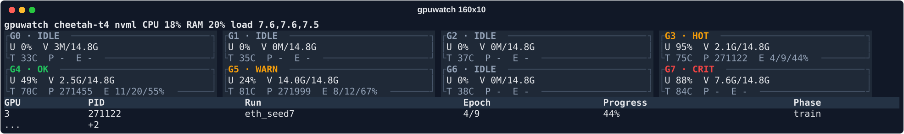
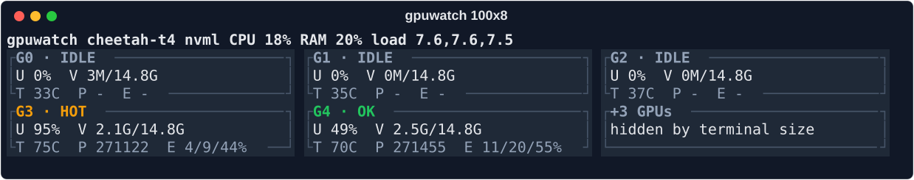
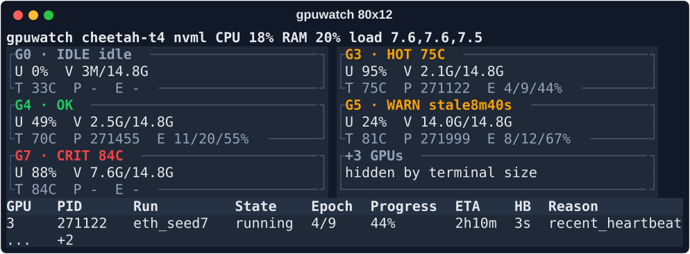
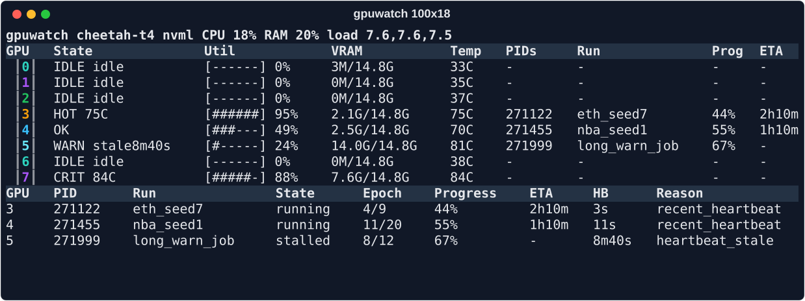
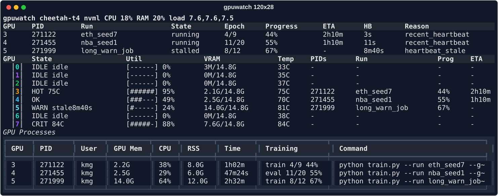
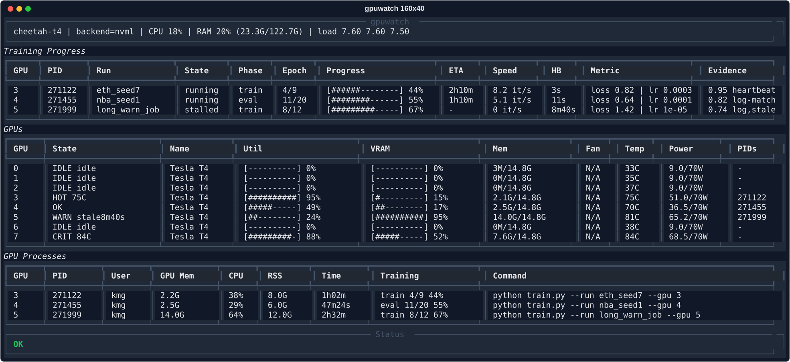
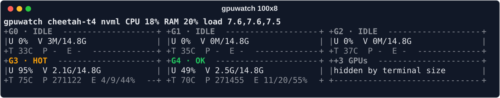

# gpuwatch responsive screenshots

Generated with `python3 tools/generate_screenshots.py`.

| Case | Size | Theme | ASCII | Preview |
| --- | ---: | --- | --- | --- |
| `01-wide-short-204x8` | `204x8` | `soft-dark` | `False` |  |
| `02-short-160x10` | `160x10` | `soft-dark` | `False` |  |
| `03-small-100x8` | `100x8` | `soft-dark` | `False` |  |
| `04-narrow-80x12` | `80x12` | `soft-dark` | `False` |  |
| `05-compact-100x18` | `100x18` | `soft-dark` | `False` |  |
| `06-medium-120x28` | `120x28` | `soft-dark` | `False` |  |
| `07-full-160x40` | `160x40` | `soft-dark` | `False` |  |
| `08-ascii-100x8` | `100x8` | `terminal` | `True` |  |
